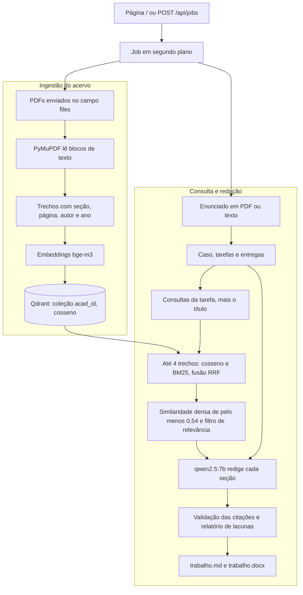

# academico-rag

Gerador local de trabalhos acadêmicos. A partir de um enunciado e de PDFs de acervo, ele separa o caso e as tarefas, recupera trechos desses PDFs e redige o texto em Markdown e DOCX. A citação que permanece no trabalho aponta para um trecho recuperado. Frase com referência fabricada sai do texto e entra num relatório de lacunas.

O enunciado define o que resolver. O acervo é a única fonte citável. Busca e redação rodam na máquina, com [Ollama](https://ollama.com) e [Qdrant](https://qdrant.tech).

## O que o projeto faz

- Página em `http://127.0.0.1:8000` para enviar título, enunciado, PDFs e orientações, acompanhar o andamento e baixar o resultado.
- API HTTP com o mesmo fluxo. A criação do trabalho devolve um id na hora; a geração segue em segundo plano.
- Leitura do enunciado em PDF (PyMuPDF) ou em texto colado. Tarefas com cabeçalho `Passo 1:`, `Etapa 2:`, `Tarefa 3:` e formas parecidas (`Atividade`, `Parte`, `Questão`). Sem esses cabeçalhos, o modelo tenta extrair as tarefas.
- Estudo de caso separado das tarefas. Fatos da organização viram insumo da introdução e da solução. O PDF do enunciado não é indexado.
- Ingestão dos PDFs do acervo com PyMuPDF: blocos de texto em ordem de leitura, quebra por seção e metadados para citação.
- Índice vetorial de um trabalho no Qdrant (coleção `acad_` mais o id do job), com embeddings `bge-m3`.
- Busca híbrida: similaridade de cosseno e BM25, combinadas por Reciprocal Rank Fusion.
- Redação com `qwen2.5:7b`, em português, numa estrutura fixa de trabalho: introdução, desenvolvimento por tarefa, conclusão e referências.
- Validação do Markdown antes de gravar o arquivo: identificador de trecho vira citação autor-data; citação sem trecho é removida.
- DOCX com página A4, margens, fonte e espaçamento definidos no código, capa com campos para preencher e sumário como campo do Word.
- Orientações de forma (`norms`) gerais e por passo, quando o texto traz cabeçalhos como `PASSO 1`.
- Testes automáticos da extração de tarefas, da política de citação e da numeração dos subtítulos, sem subir Ollama nem Qdrant.

O Markdown gerado segue este esqueleto (`app/generate.py`):

```markdown
# Título informado no pedido

## 1 INTRODUÇÃO

## 2 DESENVOLVIMENTO

### 2.1 Passo 1: título da tarefa
#### 2.1.1 Fundamentação teórica
#### 2.1.2 Solução proposta
#### 2.1.3 Conclusão da etapa e autoavaliação

## 3 CONCLUSÃO

## REFERÊNCIAS

---

## Relatório de lacunas
```

A solução pode ganhar subtítulos próprios (`2.1.2.1`, `2.1.2.1.1`). Subtítulo da solução que fale de fundamentação, conceituação, conclusão ou autoavaliação é descartado: essas partes já têm seção própria. Há no máximo 8 tarefas; as demais são cortadas na leitura do enunciado. Introdução, conclusão da etapa e conclusão geral saem sem citação de acervo. A fundamentação e a solução podem citar trechos. O relatório de lacunas vem depois do separador, e o texto dessa seção diz que ela não faz parte do trabalho. Na página, a prévia mostra o trabalho sem essa seção e lista as lacunas ao lado. O `.docx` inclui a seção.

## Arquitetura



Sem PDFs de acervo, a ingestão é pulada. O texto ainda é gerado, com a lacuna de que não há citações nem referências.

### Ingestão

PyMuPDF percorre os blocos de texto de cada página de cima para baixo e da esquerda para a direita, e ignora um número de página isolado (até três dígitos). Um bloco vira seção quando a fonte é pelo menos 1,18 vezes a mediana e também pelo menos um ponto maior, ou quando a linha tem no máximo 80 caracteres e as letras estão em caixa alta. Linha com mais de 140 caracteres ou mais de 16 palavras permanece no corpo. O título fica no campo `heading` e sai do corpo do trecho.

O alvo é 800 caracteres por trecho, com teto de 900. Texto maior quebra no fim da frase. Trecho com menos de 40 caracteres é anexado ao anterior. Trecho com menos de 80 caracteres e a mesma seção do anterior também é anexado. Cada trecho recebe um id `c1`, `c2`, … Se nenhum dos PDFs tiver texto selecionável, o job termina em erro: a mensagem diz que o arquivo precisa ter texto, não só imagem.

Autor, ano e título saem nesta ordem:

1. Nome do arquivo `AUTORES_ANO_Titulo.pdf`. Vários sobrenomes se separam por vírgula (`AUTOR,AUTOR_2020_Titulo do texto.pdf`). Hífen no título vira espaço. Com mais de três autores, a citação fica `PRIMEIRO et al.`
2. Metadados do PDF, quando há autor e um ano em `creationDate`. O sobrenome usado é a última palavra de cada nome. Esse ano é o da data de criação do arquivo, que pode diferir do ano da publicação.
3. Uma linha de autoria entre os 12 primeiros blocos das duas primeiras páginas, no formato `Sobrenome, Nome. 2021`. Nesse caso o texto da linha entra como autor, sem passar para maiúsculas.

Os sobrenomes do nome de arquivo e dos metadados entram em maiúsculas, separados por `; `, no padrão autor-data usado na citação. Sem autor ou ano identificáveis, a validação registra a lacuna e pede o padrão de nome acima; o rótulo usa `[s.d.]` quando o ano falta.

### Consulta

Para cada tarefa, `qwen2.5:7b` devolve até 4 consultas curtas em JSON. O título da tarefa entra sempre. O conjunto fica em no máximo 5 consultas. Se o JSON falhar, só o título é usado.

Cada consulta gera um embedding e chama a busca híbrida:

- Qdrant devolve até 10 vizinhos por cosseno. Entra no ranking denso quem tem nota maior ou igual a `0,30`.
- BM25 (`rank-bm25`) roda em memória sobre o texto dos trechos daquele job, também até 10, e só considera nota maior que zero. O índice lexical não fica gravado no Qdrant.
- A fusão é Reciprocal Rank Fusion com `k = 60`. A busca devolve até 4 trechos. A nota que acompanha o trecho é a similaridade densa (zero se o trecho só apareceu no BM25).

Vira evidência o trecho com similaridade densa de pelo menos `0,54`. A lista da tarefa é deduplicada em no máximo 8 trechos. Em seguida o modelo de chat indica quais desses trechos servem de fundamentação. A leitura aceita qualquer id `cN` presente na resposta, porque o modelo nem sempre usa a chave pedida. Trecho de outro assunto sai. Se nada sobrar, o relatório de lacunas registra isso e a fundamentação segue sem citação de acervo.

A fundamentação recebe os trechos aceitos. A solução recebe os 4 primeiros dessa lista. O modelo marca o trecho com o id dele, por exemplo `[c3]`. Se a fundamentação voltar sem nenhum id, uma segunda chamada pede para recolocar o id só na frase que um trecho realmente sustenta.

Antes de alternar entre embedding e chat, o processo pede ao Ollama para descarregar o modelo que não vai usar (`keep_alive` 0). O contexto de geração é 8192 tokens. O comentário em `app/config.py` dimensiona esse contexto para uma GTX 1660 de 6 GB com `qwen2.5:7b` em Q4.

### Validação

`app/validate.py` percorre o Markdown e aplica a política coberta por `tests/test_offline.py`:

- `[c3]` de um trecho com autor `KENT; SOUPPAYA` e ano `2006` vira `(KENT; SOUPPAYA, 2006)`.
- `Segundo [c1], ...` vira forma narrativa, como `Segundo Kent e Souppaya (2006), ...`. O comentário no código aponta essa forma para a NBR 10520.
- Vários ids no mesmo ponto viram uma citação só, com autores separados por `; `.
- Frase de conhecimento geral, sem id, permanece.
- Sai a frase com ano e autor escritos pelo modelo sem id de trecho, a frase que cita um id inexistente, a atribuição a uma pessoa sem trecho ou diferente do autor do trecho, a frase que usa o enunciado como fonte e a frase institucional (saudação ao aluno, nota, critério de correção).
- A partir da primeira linha com escrita japonesa, chinesa ou coreana, o restante da seção é descartado. Antes dessa limpeza, a geração já tenta outra resposta pedindo português do Brasil.
- Linha repetida fica em no máximo três ocorrências. Repetição em laço dentro da linha é cortada. Tabela Markdown envolvida por uma cerca de código é desembrulhada.

A bibliografia lista só arquivos efetivamente citados, uma linha por arquivo: autor, título em negrito e ano. Introdução, fechamento da etapa e conclusão são limpos com citação desligada: os ids são apagados.

## Tecnologias

| Peça | Papel neste repositório |
| --- | --- |
| Python 3.10+ | Sintaxe usada no código (`list[str]`, `X \| Y`) |
| FastAPI e Uvicorn | API, upload e job em segundo plano |
| PyMuPDF | Texto do enunciado e dos PDFs do acervo |
| Ollama | Chat `qwen2.5:7b` e embeddings `bge-m3` |
| Qdrant | Uma coleção vetorial por trabalho |
| rank-bm25 | Ranking lexical em memória |
| python-docx | `trabalho.docx` |
| httpx | Chamadas ao Ollama e o script de exemplo |

Os nomes dos modelos e os limiares estão em `app/config.py`. Não há variável de ambiente para trocá-los.

Dependências e versões mínimas estão em [`requirements.txt`](requirements.txt):

```
fastapi>=0.115
uvicorn>=0.32
python-multipart>=0.0.12
qdrant-client>=1.13
rank-bm25>=0.2.2
pymupdf>=1.24
httpx>=0.27
python-docx>=1.1
```

## Requisitos

- Docker com o plugin Compose, para o Qdrant de [`docker-compose.yml`](docker-compose.yml).
- [Ollama](https://ollama.com) em execução na máquina. A imagem do Compose não inclui o Ollama.
- Python 3.10 ou superior.
- Os dois modelos com estes nomes: `qwen2.5:7b` e `bge-m3`. A checagem de saúde aceita o nome exato ou um nome que comece com ele seguido de `:`.
- PDFs com texto selecionável. O projeto não faz OCR.
- Espaço em disco para os modelos e para o volume do Qdrant.

O `run.ps1` foi escrito para Windows. No Linux e no macOS os mesmos passos usam o terminal, como abaixo.

## Como executar

Na raiz do repositório.

### 1. Subir o Qdrant

```bash
docker compose up -d
```

O serviço publica a porta `6333` e grava os dados no volume `qdrant_storage`. Confira com `docker compose ps`.

### 2. Baixar os modelos no Ollama

```bash
ollama pull qwen2.5:7b
ollama pull bge-m3
ollama list
```

### 3. Instalar o projeto

Windows (PowerShell):

```powershell
python -m venv .venv
.\.venv\Scripts\python -m pip install -r requirements.txt
```

Linux ou macOS:

```bash
python3 -m venv .venv
.venv/bin/python -m pip install -r requirements.txt
```

### 4. Variáveis de ambiente

Todas são opcionais. Os padrões já apontam para a máquina local.

| Variável | Quem lê | Padrão | Função |
| --- | --- | --- | --- |
| `OLLAMA_URL` | API | `http://127.0.0.1:11434` | URL do Ollama |
| `QDRANT_URL` | API | `http://127.0.0.1:6333` | URL do Qdrant |
| `ACADEMICO_RAG_DATA` | API | `~/.local/academico-rag` | Pasta dos jobs: PDFs enviados, `trabalho.md` e `trabalho.docx` |
| `RAG_URL` | `exemplo/rodar_job.py` | `http://127.0.0.1:8000` | URL da API para o script de exemplo |
| `OLLAMA_MAX_LOADED_MODELS` | definida pelo `run.ps1` | `1` nesse script | Ver a nota abaixo |

O `run.ps1` define `OLLAMA_MAX_LOADED_MODELS=1` no processo que inicia a API. Essa variável limita quantos modelos o Ollama mantém carregados quando o **servidor** Ollama sobe com ela. O código da aplicação, à parte, descarrega um modelo antes de usar o outro.

### 5. Iniciar a API

Windows, na raiz:

```powershell
.\run.ps1
```

O script sobe o Compose de novo, escolhe o Python de `.venv\Scripts\python.exe`, depois o de `%USERPROFILE%\.local\academico-rag\venv\Scripts\python.exe`, e por último o `python` do `PATH`. Em seguida escuta em `127.0.0.1:8000`.

Linux ou macOS, com o ambiente virtual ativo e o Qdrant no ar:

```bash
python -m uvicorn app.main:app --host 127.0.0.1 --port 8000
```

Abra [http://127.0.0.1:8000](http://127.0.0.1:8000). A página avisa se o Ollama, o Qdrant ou algum dos dois modelos estiver ausente.

Não existe comando separado de ingestão. Os PDFs entram no `POST /api/jobs` e são indexados dentro daquele job.

### 6. Pedido pela interface

1. Informe o título.
2. Envie o PDF do enunciado ou cole o texto. O texto precisa de um cabeçalho como `Passo 1:` para a extração por regra. Sem isso, a extração depende do modelo.
3. Envie um ou mais PDFs de acervo. O nome recomendado é `AUTOR,AUTOR_ANO_Titulo.pdf`.
4. Cole orientações de forma, se quiser. Cabeçalhos `PASSO 1`, `ETAPA 2` e equivalentes separam a orientação de cada tarefa.
5. Acompanhe o status. Com o trabalho pronto, baixe Markdown e DOCX.

Um enunciado mínimo, genérico:

```text
Contexto
A oficina Alfa anota pedidos em papel.

Passo 1: Registrar pedidos
Descreva um fluxo simples de registro.
O que entregar:
- Lista de requisitos.
```

### 7. Pedido com curl

Os exemplos abaixo são bash. No PowerShell, `curl` é outro comando; use `curl.exe` ou a página.

A saúde do ambiente:

```bash
curl -s http://127.0.0.1:8000/api/health
```

Resposta no formato:

```json
{
  "ollama": true,
  "qdrant": true,
  "chat_model": true,
  "embed_model": true
}
```

Criar um trabalho com enunciado em texto e um PDF de acervo. Troque o caminho do arquivo. Repita `-F files=@...` para cada PDF.

```bash
curl -s -X POST http://127.0.0.1:8000/api/jobs \
  -F "theme=Registro de pedidos da oficina Alfa" \
  -F "brief_text=Contexto
A oficina Alfa anota pedidos em papel.

Passo 1: Registrar pedidos
Descreva um fluxo simples de registro.
O que entregar:
- Lista de requisitos." \
  -F "norms=Texto em português. Citação no formato autor-data." \
  -F "files=@AUTOR_2020_Titulo.pdf;type=application/pdf"
```

A resposta é um JSON com a chave `id`, um hexadecimal de 32 caracteres (`uuid4().hex`). Consultar o andamento:

```bash
curl -s http://127.0.0.1:8000/api/jobs/JOB_ID
```

O corpo tem `id`, `status`, `detail`, `sections_total`, `sections_done`, `gaps`, `preview`, `title` e `error`. Com uma tarefa, `sections_total` é 3: introdução, a tarefa e conclusão. `status` percorre `queued`, `extracting`, `indexing` (quando há PDF), `planning`, `retrieving` (quando há PDF), `writing`, e termina em `done` ou `error`.

Quando `status` for `done`:

```bash
curl -s -o trabalho.md http://127.0.0.1:8000/api/jobs/JOB_ID/trabalho.md
curl -s -o trabalho.docx http://127.0.0.1:8000/api/jobs/JOB_ID/trabalho.docx
```

Enunciado em PDF, no lugar do texto:

```bash
curl -s -X POST http://127.0.0.1:8000/api/jobs \
  -F "theme=Título do trabalho" \
  -F "brief=@enunciado.pdf;type=application/pdf" \
  -F "files=@AUTOR_2020_Titulo.pdf;type=application/pdf"
```

Se o PDF do enunciado e o texto forem enviados juntos, o PDF é o que a geração lê. Cada chamada de chat ao Ollama pode levar até 600 segundos. O script de exemplo espera até 3600 segundos pelo `done`.

### 8. Script de exemplo

`exemplo/rodar_job.py` é um cliente ponta a ponta. Ele exige a API no ar, PDFs em `exemplo/acervo/` (pasta listada no `.gitignore`, fora deste repositório) e um enunciado:

```bash
python exemplo/rodar_job.py caminho/do/enunciado.pdf
```

O script envia o tema fixo definido nele, o conteúdo de [`exemplo/normas_camc.md`](exemplo/normas_camc.md) no campo de orientações e todos os `*.pdf` de `exemplo/acervo/`. Grava Markdown e DOCX em `exemplo/saida_camc/`, também fora do Git. Imprime `OK` ou `FALHA` para checagens do texto e do DOCX e termina com código 1 se alguma falhar.

Sem o argumento, o script procura `PROJETO_INTEGRADO*.pdf` na pasta pai do repositório. Esse arquivo não faz parte do clone.

`exemplo/criar_pdf.py` gera um PDF curto de demonstração em `exemplo/compostagem.pdf`. O script aponta para a fonte `C:\Windows\Fonts\times.ttf`, então é um utilitário de Windows. O PDF gerado também fica de fora do Git (`exemplo/*.pdf` no `.gitignore`).

## API

Base: `http://127.0.0.1:8000`. Não há autenticação. O processo iniciado pelo `run.ps1` e pelo comando uvicorn acima escuta só em `127.0.0.1`.

| Método | Caminho | Função |
| --- | --- | --- |
| `GET` | `/` | Página do formulário |
| `GET` | `/api/health` | `ollama`, `qdrant`, `chat_model`, `embed_model` |
| `POST` | `/api/jobs` | Cria o job. Corpo `multipart/form-data` |
| `GET` | `/api/jobs/{job_id}` | Estado do job |
| `GET` | `/api/jobs/{job_id}/trabalho.md` | Markdown, `text/markdown; charset=utf-8` |
| `GET` | `/api/jobs/{job_id}/trabalho.docx` | DOCX |
| `GET` | `/static/...` | Arquivos de `app/static`. A página em `/` traz o CSS no próprio HTML |

Campos do `POST /api/jobs`:

| Campo | Obrigatório | Conteúdo |
| --- | --- | --- |
| `theme` | sim | Título. Vazio responde 400, `Informe o tema.` |
| `brief` | um dos dois | PDF do enunciado |
| `brief_text` | um dos dois | Enunciado colado. Sem PDF e sem texto: 400, `Envie o PDF do enunciado ou cole o enunciado em texto.` |
| `files` | não | Um ou mais PDFs de acervo. Repita o campo para cada arquivo |
| `norms` | não | Orientações de forma |

Arquivo que não termina em `.pdf`, ou arquivo vazio, responde 400. Job desconhecido em `GET /api/jobs/{job_id}` responde 404, `Trabalho não encontrado.` Download antes do arquivo existir responde 404, `O arquivo ainda não está pronto.`

O estado do job fica num dicionário do processo. Reiniciar a API perde esse estado: o `GET` do job passa a responder 404. Os arquivos já gravados em `ACADEMICO_RAG_DATA/jobs/{id}/` continuam no disco, e o download lê o arquivo direto, sem consultar o dicionário.

FastAPI também publica a documentação interativa em `/docs`, porque a aplicação não desliga esse recurso.

## Testes

Na raiz do repositório, com as dependências instaladas:

```bash
python -m tests.test_offline
```

O módulo não chama Ollama nem Qdrant. Cada função `test_*` imprime `OK` ao passar. Uma asserção que falha encerra o processo com traceback.

`test_brief_camc` só lê um enunciado se existir `PROJETO_INTEGRADO*.pdf` na pasta pai do repositório. Sem esse arquivo o teste imprime `SKIP brief: PDF do enunciado não encontrado` e, em seguida, `OK test_brief_camc`. Os outros testes usam trechos e textos montados no próprio arquivo.

Dois scripts manuais dependem da pilha no ar, de um `job_id` que tenha indexado `exemplo/acervo` e, no segundo, do PDF de enunciado na pasta pai do repositório:

```bash
python -m tests.calibrar_busca JOB_ID
python -m tests.depurar_relevancia JOB_ID
```

O primeiro imprime a similaridade densa das consultas fixas no arquivo. O segundo imprime, por tarefa, os trechos candidatos e os que o filtro de relevância manteve. O comentário de `EVIDENCE_MIN` em `app/config.py` aponta `tests/calibrar_busca.py` como o script usado para calibrar o corte.

## Estrutura

```
app/
  __init__.py        pacote (arquivo vazio)
  main.py            API, jobs e downloads
  config.py          modelos, limiares, pastas e URLs
  brief.py           enunciado → caso, tarefas e entregas
  ingest.py          PDF → trechos e metadados de citação
  store.py           coleção Qdrant do job
  retrieve.py        cosseno, BM25 e RRF
  ollama_client.py   chat, embeddings e descarga de modelo
  generate.py        plano de busca, redação e montagem do Markdown
  validate.py        limpeza, citação autor-data e bibliografia
  docx_writer.py     Markdown → DOCX
  static/index.html  formulário
exemplo/
  normas_camc.md     exemplo de orientações separadas por passo
  rodar_job.py       cliente ponta a ponta
  criar_pdf.py       PDF mínimo de demonstração no Windows
tests/
  __init__.py            pacote (arquivo vazio)
  test_offline.py        testes sem Ollama e sem Qdrant
  calibrar_busca.py      notas de similaridade de um job
  depurar_relevancia.py  filtro de relevância de um job
docker-compose.yml   Qdrant na porta 6333
requirements.txt
run.ps1              Windows: Compose e Uvicorn
```

Pastas e arquivos que o `.gitignore` deixa de fora: `exemplo/acervo/`, `exemplo/saida_camc/`, `exemplo/*.pdf`, ambientes virtuais e `.env`.

## Decisões e limitações

O enunciado e o acervo seguem caminhos diferentes de propósito. O modelo recebe o caso e o que a tarefa pede, e a validação remove frase que trate o enunciado, o roteiro ou o material do curso como fonte. A referência bibliográfica só nasce de um trecho que a redação marcou com id válido.

O modelo marca `[cN]`. A troca para autor-data acontece no código, com o autor e o ano extraídos na ingestão. Referência escrita pelo modelo sem esse id sai da frase. A qualidade da citação depende do nome do arquivo ou dos metadados. A entrada da bibliografia traz autor, título e ano. Editora, cidade e edição ficam de fora.

A capa do DOCX usa textos fixos (`NOME DA INSTITUIÇÃO`, `NOME DO CURSO`, `NOME COMPLETO DO(A) ESTUDANTE`, `Cidade`, `Ano`). O sumário é um campo `TOC` do Word; o arquivo pede para atualizar o campo. O corpo numera a página no cabeçalho. O módulo descreve o DOCX como padrão da NBR 14724 e aplica A4, margens de 3 cm no topo e na esquerda e 2 cm embaixo e na direita, Arial 12 e entrelinha 1,5. Tabela e bloco de código ganham a linha `Fonte: Elaborado pelo autor.`

A nota densa é o corte da evidência. Um trecho que só o BM25 colocou no topo continua de fora quando a similaridade de cosseno fica abaixo de `0,54`. O filtro seguinte é outra chamada ao modelo: a similaridade, sozinha, não separa assunto.

O estado do job não é persistente e não há fila externa nem autenticação. O desenho é um processo local. Mais de um worker do Uvicorn não compartilha o dicionário de jobs. Os nomes `qwen2.5:7b` e `bge-m3` estão fixos em `app/config.py`.

O código não faz OCR e não define teto de upload: o tamanho do PDF fica com o cliente e o disco. A redação varia com o modelo local. Repetição e mudança de idioma têm contenção no código; o relatório de lacunas é o lugar em que isso aparece para quem lê o resultado.

## Autor

**Braian Sins** — [GitHub](https://github.com/bardodb) · [LinkedIn](https://www.linkedin.com/in/braian-patrike-vidal-sins/)
